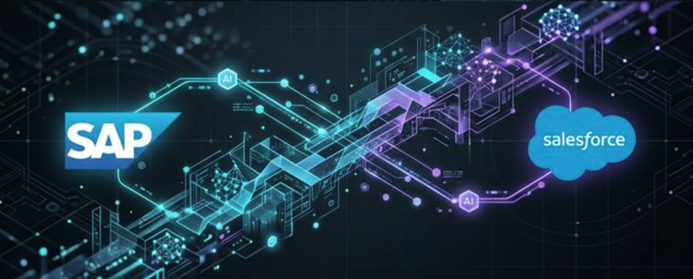

# Hello, I'm Ameya 👋

  

## 🚀 Bridging the Gap: AI, SAP & Salesforce

I specialize in building **Agentic Workflows** and modern integrations that move beyond simple API calls. My focus is on using **Google ADK (Agentic Development Kit)** and **LLMs (Gemini)** to solve complex business problems by connecting enterprise data silos—specifically **SAP** and **Salesforce**.

---

### 🧠 Featured Agentic Architectures

*   **[Smart Closer](https://github.com/ameya-sap/gnext-2026-smart-closer)**: An autonomous orchestration agent that resolves semantic gaps between Salesforce and SAP data using Gemini Enterprise ADK.
*   **[Vision-Agent-Sentry](https://github.com/ameya-sap/Vision-Agent-Sentry)**: A "Hybrid Reality" architecture combining **TensorFlow (MobileNetV2)** computer vision with a Gemini-powered situational reasoning "brain".
*   **[Gen UI Bridge (UI5)](https://github.com/ameya-sap/gen-ui-bridge-ui5)**: Prototype exploring **Generative UI (A2UI)** in OpenUI5, allowing AI Agents to dynamically render native SAP controls.
*   **[Credit Note Processing](https://github.com/ameya-sap/align_creditnote_processing)**: Automating end-to-end credit note workflows across SAP and Salesforce.
*   **[Decision Agent Demo](https://github.com/ameya-sap/decision-agent-demo)**: Automating complex business rules using Google ADK, A2A, and MCP.
*   **[ADK SpaCy Router](https://github.com/ameya-sap/adk-spacy-router-agent)**: Modular Google ADK project demonstrating a hybrid NLP architecture using spaCy for NER and Gemini for reasoning.
*   **[Financial Report Summarizer](https://github.com/ameya-sap/financial_report_summarizer)**: AI-driven analysis and summarization of large-scale financial reports.
*   **[AI Guardrails Demo](https://github.com/ameya-sap/guardrail-agent-demo)**: Implementation of safety and policy layers (Guardrails) for AI Agents using Google ADK.
*   **[Hazmat Copilot](https://github.com/ameya-sap/hazmat-copilot)**: Orchestrating safety data intelligence with LlamaIndex and Google ADK.

---

### 🛠️ My Tech Stack

| Domain | Technologies |
| :--- | :--- |
| **Generative AI** | Google ADK, Gemini Express/Enterprise, MCP (Model Context Protocol), LangChain |
| **Enterprise** | SAP (UI5/OpenUI5, BTP, OData, S/4HANA), Salesforce (SFDC APIs, Integration) |
| **Backend** | Python (FastAPI, Flask), Node.js, BigQuery, TensorFlow |
| **Frontend** | OpenUI5, TypeScript, JavaScript, React |

---

### ✍️ Technical Writing

I regularly write about the intersection of Enterprise Systems and Agentic AI on **[Medium](https://medium.com/@ameyaps_98908)**.

*   **[The Agentic Mindset](https://medium.com/@ameyaps_98908/the-agentic-mindset-engineering-autonomous-partners-not-just-fancy-chatbots-8c5d6e7f8a9b)**: Shifting from chatbots to autonomous partners that can take real-world actions.
*   **[Pro-Level Agent Observability](https://medium.com/@ameyaps_98908/pro-level-agent-observability-deploying-arize-phoenix-on-google-cloud-87a3b2c1d3e4)**: Implementing Arize Phoenix on Google Cloud for complex multi-agent systems (SFDC + SAP).
*   **[The Eyes and the Brain](https://medium.com/@ameyaps_98908/the-eyes-and-the-brain-why-specialized-image-ml-still-rules-in-the-era-of-llms-6f5d4e3c2b1a)**: Why specialized ML (TensorFlow) still beats LLMs for raw detection in "Hybrid Reality" architectures.
*   **[Generative UI with SAP UI5](https://medium.com/@ameyaps_98908/is-this-the-future-of-sap-joule-and-ui5-exploring-generative-ui-with-ag-ui-and-a2ui-4e3d2c1b0a9b)**: Exploring the future of SAP Joule and UI5 via the AG-UI protocol.
*   **[Hybrid AI Agents](https://medium.com/@ameyaps_98908/the-best-of-both-worlds-building-hybrid-ai-agents-with-spacy-and-google-adk-2e1d0c9b8a7f)**: Combining the speed of spaCy with the reasoning of Google ADK.
*   **[Hazmat Copilot](https://medium.com/google-cloud/hazmat-copilot-orchestrating-safety-data-intelligence-with-llamaindex-and-google-adk-9b9edb2eeae7)**: Orchestrating safety data intelligence with LlamaIndex and Google ADK.

---

 ### 📉 GitHub Stats

  
  

---

### 📫 Reach Out

- **LinkedIn**: [Connect with me on LinkedIn](https://www.linkedin.com/in/ameyasuvarna/)
- **Work**: Exploring the future of GenAI in Enterprise Systems.

---

  <i>"Automating the future, one agent at a time."</i>

